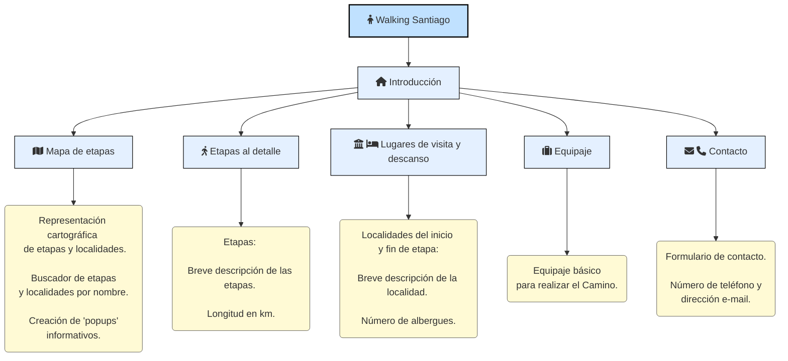

# Walking Santiago

## Tema y motivación
En el desarrollo de esta web, he escogido la temática del Camino de Santiago, en concreto el Camino Francés. Con ello he descargado las etapas principales del Camino desde la ciudad francesa de Saint Jean Pied-de-Port hasta Santiago de Compostela; fuente del Instituto Geográfico Nacional. 
  
A parte, se ha realizado una digitalización de esas localidades inicio y fin de etapa. En estas se ha incluido información respecto al descanso del peregrino, en concreto, el número de albergues disponibles en la localidad. 
  
Otros recursos publicados en la web corresponden a una breve descripción de las Etapas y las Localidades de inicio y fin de etapa. 
  
También se han incluído imágenes de cada una de las localidades en: images/supply_points.
  
En adición, se incluye un relato sobre qué materiales concretos y consejos respecto al equipaje debe llevar un peregrino en realización del Camino.
  
Finalmente, se introducirá un apartado para contactar con el responsable para realizar los correspondientes servicios.
  
*Los datos descriptivos se han extraído de:*  
*https://www.alberguescaminosantiago.com/poblaciones/o-pedrouzo-la-coruna-camino-de-santiago/*   
*https://www.columbus-outdoor.com/blog/llevar-la-mochila-camino-santiago/*  
*https://marlycamino.com/es/como-organizar-una-mochila-para-el-camino-de-santiago/*

## Datos 
A continuación, voy a representar un ejemplo del conjunto de datos que se recogerán en la web.

**Etapa 1 - Saint-Jean-Pied-de-Port - Roncesvalles**  
- Distancia: 24,2 km  
- Breve descripción: La primera etapa constituye una de las más difíciles del Camino. En plena Navarra francesa el peregrino debe cruzar el Pirineo hacia el Monasterio de Roncesvalles, puerte de la Navarra española, dirección oeste hacia Santiago. 
  

**Saint-Jean-Pied-de-Port.**  
- Distancia a Santiago: 773 km  
- Número de alojamientos: 12  
- Breve descripción: Saint-Jean-Pied-de-Port, un lugar más que mítico en el Camino de Santiago, punto clave de encuentro para millones de peregrinos del norte y centro de Europa durante siglos, que sigue rezumando esencia jacobea en todas sus calles y rincones.
Es una importante población dentro del Camino de Santiago, ya que en sus cercanías (en Ostabat) confluyen tres importantes ramales del Camino: la Via Turonensis o camino de Tours, la Via Podiensis o camino de Puy y la Via Lemovicensis o camino de Limoges.
 

**bold text**

*italicized text*
> blockquote

1. First item
2. Second item
3. Third item

- First item
- Second item
- Third item

`code`

Inline `code` example...
 
---

## Estructura de la web

Un text explicatiu que apunta a aquest [link](https://www.example.com)

## Cartografía con qgis2web
La siguiente imagen corresponde al diseño de impresión del mapa interactivo publicador en la web. 
 
 

## Dificultades y mejoras

## Recursos
*Enlaces a recursos:* 
*https://www.markdownguide.org/cheat-sheet/*  
*https://stackedit.io/*  
*https://www.w3schools.com/html/default.asp*

