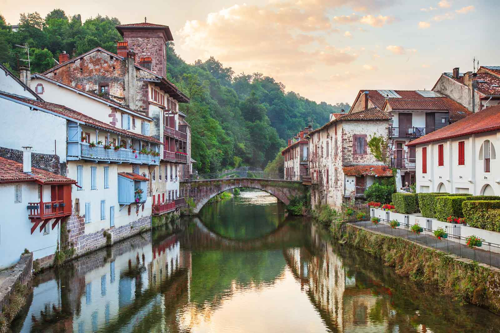

# Walking Santiago

## Tema y motivación
En el desarrollo de esta web, he escogido la temática del Camino de Santiago, en concreto el Camino Francés. Con ello he descargado las etapas principales del Camino desde la ciudad francesa de Saint Jean Pied-de-Port hasta Santiago de Compostela; fuente del Instituto Geográfico Nacional. 
  
A parte, se ha realizado una digitalización de esas localidades inicio y fin de etapa. En estas se ha incluido información respecto al descanso del peregrino, en concreto, el número de albergues disponibles en la localidad. 
  
Otros recursos publicados en la web corresponden a una breve descripción de las Etapas y las Localidades de inicio y fin de etapa. 
  
También se han incluído imágenes de cada una de las localidades en: images/supply_points.
  
En adición, se incluye un relato sobre qué materiales concretos y consejos respecto al equipaje debe llevar un peregrino en realización del Camino.
  
Finalmente, se introducirá un apartado para contactar con el responsable para realizar los correspondientes servicios.
  
*Los datos descriptivos se han extraído de:*  
*https://www.alberguescaminosantiago.com/poblaciones/o-pedrouzo-la-coruna-camino-de-santiago/*   
*https://www.columbus-outdoor.com/blog/llevar-la-mochila-camino-santiago/*  
*https://marlycamino.com/es/como-organizar-una-mochila-para-el-camino-de-santiago/*

## Datos 
El esquema del repositiro GIT es básico.  
En el se encuentran en primer lugar diferentes carpetas:  
- **Data:** que incluye el proyecto y capas cartografiadas en formato Geopackage. 
- **Images:** en ella se incluyen todas las imágenes que se utilizarán en la web. Dentro de la misma hay subcarpetas: equipaje, esquema, icon y supply_points. 
- **Maps:** con toda la información correspondiente al mapa web. 
- **Style:** en ella se incluyen dos archivos .css los cuales he estado realizando pruebas mediante el index.html 
  
También encontramos: 
- **.gitignore**: se han incluido documentos de tipo temporal (relacionados con SIG, Office) o no interesantes para el lector (contraseñas).
- **LICENSE**: La licencia 
  
A continuación,  voy a representar a modo de ejemplo del conjunto de datos que se recogerán en la web, unos textos o imagenes que se incluirán en sus respectivos apartados:
  
**Etapa 1 - Saint-Jean-Pied-de-Port - Roncesvalles**  
- Distancia: 24,2 km  
- Breve descripción: La primera etapa constituye una de las más difíciles del Camino. En plena Navarra francesa el peregrino debe cruzar el Pirineo hacia el Monasterio de Roncesvalles, puerte de la Navarra española, dirección oeste hacia Santiago. 
  

**Saint-Jean-Pied-de-Port.**   
  
- Distancia a Santiago: 773 km  
- Número de alojamientos: 12  
- Breve descripción: Saint-Jean-Pied-de-Port, un lugar más que mítico en el Camino de Santiago, punto clave de encuentro para millones de peregrinos del norte y centro de Europa durante siglos, que sigue rezumando esencia jacobea en todas sus calles y rincones.
Es una importante población dentro del Camino de Santiago, ya que en sus cercanías (en Ostabat) confluyen tres importantes ramales del Camino: la Via Turonensis o camino de Tours, la Via Podiensis o camino de Puy y la Via Lemovicensis o camino de Limoges.
 

**Qué equipaje llevo?**   
  
- Ropa y calzado:
Aquí depende mucho de para qué época del año estés preparando la mochila para el Camino de Santiago. También si vas a hacer la ruta completa del camino Francés desde Roncesvalles o si solamente vas a realizar el tramo gallego.
- Zapatillas de senderismo. De caña baja o media. Es preferible que ya las hayas usado una temporada y comprobado su comodidad. En invierno puede ser necesario llevar botas de trekking.
- Chanclas. Necesarias para la ducha en el albergue y para que los pies respiren tras cada jornada.
- Camisetas. 2 para caminar y una para el término de cada jornada.
- Pantalones. 2 para caminar y uno para descanso. Largos o cortos, según la época y el gusto.
- Jersey o sudadera. 1 en verano, 2 en invierno.
- Ropa interior. Mejor sin costuras. 3 mudas completas. 2 si solo vas a hacer el tramo final.
- Calcetines. 2 o 3 pares. Siempre sin costuras.
- Gorra o visera para proteger del frío y del calor.
- Impermeable. Si vas a hacer un tramo puedes mirar la previsión del tiempo y quizá no lo necesites. Pero para una ruta larga, no dudes de su importancia.

**bold text**

*italicized text*
> blockquote

1. First item
2. Second item
3. Third item

- First item
- Second item
- Third item

`code`

Inline `code` example...
 
---

## Estructura de la web

Un text explicatiu que apunta a aquest [link](https://www.example.com)

## Cartografía con qgis2web
La siguiente imagen corresponde al diseño de impresión del mapa interactivo publicador en la web. 
 
 

## Dificultades y mejoras
Las principales dificultades o limitaciones se remiten al uso del lenguaje de programación. Si bien es cierto que he programado con Python anteriomente, nunca había usado el lenguaje **html** para el desarrollo de una web.   
No obstante, el uso del respositorio GIT podríamos decir que lo he empezado a dominar en pocas sesiones. 
  
En cuanto a mejoras, la intención es mejorar mapas y por tanto la cartografia temática, así como mejorar en el uso de los popups, que a pesar de poderlos representar con la información que deseaba en el proyecto de QGIS, en cuanto se realiza el mapa web no se puede ver esa misma información; entiendo que la mejora vendrá con una revisión de los pasos realizados.   
Por otra parte, las claras mejoras que se van a desarrollar en un futuro cercano se tratan de la propia web. He centrado los esfuerzos en obtener y recoger todo tipo de contenido e información que irá atada a la web; por lo tanto, en las siguientes sesiones de la asignatura el objetivo principal es plasmar esta misma en la página web, así como incluir mejoras o nuevos apartados si el tiempo y las habilidades propias lo permiten.

## Recursos
*Enlaces a recursos:* 
*https://www.markdownguide.org/cheat-sheet/*  
*https://stackedit.io/*  
*https://www.w3schools.com/html/default.asp*

